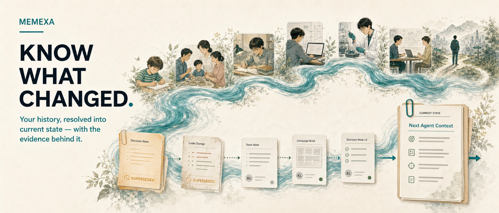
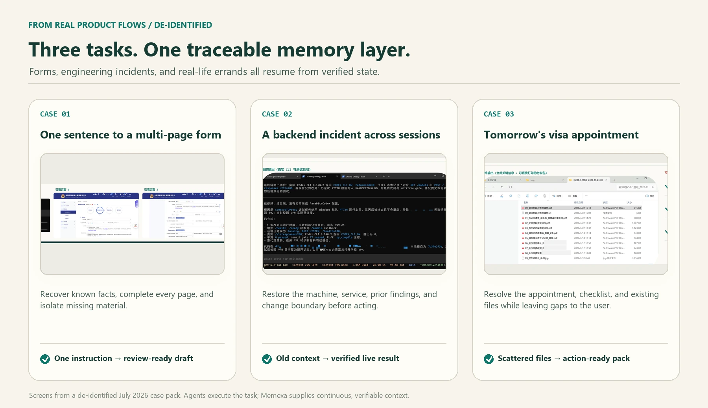

<p align="center">
  <picture>
    <source media="(max-width: 640px)" srcset="docs/assets/readme/memexa-hero-state-en-mobile.webp">
    
  </picture>
</p>

<p align="center">
  <strong>A traceable personal memory layer that carries verified state across apps, models, and agents.</strong>
</p>

<p align="center">
  <a href="https://github.com/labazhou2024/memexa/releases/download/v0.1.0/Memexa_Internal_Test_20260722_F036FCB5_R3.zip"><strong>Download for Windows</strong></a> ·
  <a href="#run-the-open-demo">Run the source demo</a> ·
  <a href="https://memexa.cn">Product overview</a> ·
  <a href="README.zh.md">简体中文</a>
</p>

<p align="center">
  <a href="https://github.com/labazhou2024/memexa/actions/workflows/ci.yml"></a>
  <a href="LICENSE"></a>
  <a href="https://pypi.org/project/memexa/"></a>
  <a href="pyproject.toml"></a>
</p>

## Start with the product

| I want to… | Start here |
|---|---|
| **Try the desktop product** | Download the [Windows 10/11 x64 internal preview](https://github.com/labazhou2024/memexa/releases/download/v0.1.0/Memexa_Internal_Test_20260722_F036FCB5_R3.zip), then follow the setup and privacy guide in the archive. |
| **Inspect the memory contract** | Run `pip install memexa` and `memexa demo`. No backend, model key, or configuration is required. |
| **Understand the full product** | Read the product overview at [memexa.cn](https://memexa.cn). |

The Windows preview is not yet code-signed. SmartScreen may show a warning;
verify the filename and SHA-256 values in the
[release notes](https://github.com/labazhou2024/memexa/releases/tag/v0.1.0)
before running it.

## The missing layer between history and the next action

Agents can already write code, complete forms, and prepare documents. The
failure appears when work crosses a session, app, model, or collaborator:
history remains available, but its **current meaning** does not.

An old plan and the decision that replaced it may both be retrieved. A machine
address may be remembered after the service moved. A checklist may be found
without showing which items are still missing. More context does not solve
this; the next agent needs resolved state.

Memexa gives it three things:

- **What changed** — which decisions, versions, and facts replaced earlier ones.
- **What still holds** — the current goal, constraints, owners, and open gaps.
- **Why it can be trusted** — the messages, documents, sessions, or commits
  behind each important claim.

The result is not a longer transcript. It is a compact, evidence-backed handoff
for the next action.

## Three real tasks, one memory layer

<p align="center">
  
</p>

These are de-identified product workflows, not generated interface mockups:

1. **Public-record filing:** one instruction became a multi-page draft; known
   facts were filled in and missing material stayed visible.
2. **Backend incident:** a new agent recovered the target machine, service
   state, prior diagnosis, and the “backend only” change boundary before
   verifying the live path.
3. **Visa appointment:** the appointment, checklist, and existing files became
   an action-ready pack; uncertain items still required human confirmation.

Agents performed the work. Memexa supplied the continuous, verifiable context
that let each task resume from the right point.

## How Memexa carries work forward

1. **Keep the source.** Imported material retains its origin and time instead
   of becoming an untraceable summary.
2. **Resolve the history.** People, events, decisions, versions, and
   relationships are organized across sources.
3. **Maintain current state.** Replacement, rejection, confirmation, and
   unresolved gaps remain explicit.
4. **Deliver the minimum useful context.** The next agent receives the facts,
   constraints, and evidence needed for the current task—not the entire
   archive.

Personal memory stays on the user's device by default. The user chooses which
sources to import and what context a connected agent may receive.

## Run the open demo

```bash
python -m pip install memexa
memexa demo
```

The demo loads six bundled sets of synthetic records—WeChat, QQ, email,
browser history, AI chat, and audio—and builds queryable memory cards entirely
in memory.

It shows:

- a memory card that keeps source, time, people, narrative, and evidence
  together;
- the same history queried by person, timeline, commitment, or topic;
- how delivered context can be checked against its original source.

To run it from a clone:

```bash
git clone https://github.com/labazhou2024/memexa.git
cd memexa
python -m memexa.cli.main demo
python -m pytest -q
```

## Source code and installer

> [!IMPORTANT]
> **The source code and the installer are different deliverables.** This
> repository contains an Apache-2.0 open demo built around synthetic data. The
> GitHub Release contains the Windows desktop product preview and its full
> product capabilities. This repository is not the installer's complete source
> tree, and the product-only capabilities in that installer are not licensed
> under this repository's Apache-2.0 license.

## Public benchmark

On the public
[ATM-Bench-Hard leaderboard](https://atmbench.github.io/leaderboard.html#leaderboard),
the full Memexa system reports **47.85% QS** and **44.67% Recall@10**. QS
measures final-answer quality; Recall@10 measures whether retrieval found the
required evidence.

QS was scored with the leaderboard's DeepSeek-V4-flash judge and should not be
compared directly with entries judged by gpt-5-mini. Recall@10 uses the fixed
Qwen3-VL-2B captions supplied by ATM-Bench.

## Local-first by default

- Import only the sources the user selects.
- Keep personal memory on the user's own device by default.
- Send connected agents only the context needed for the task.
- Preserve source references for important facts.
- Leave uncertain or consequential decisions to human confirmation.

Memexa is built around a simple premise: work should not lose its verified
state when a conversation ends.
