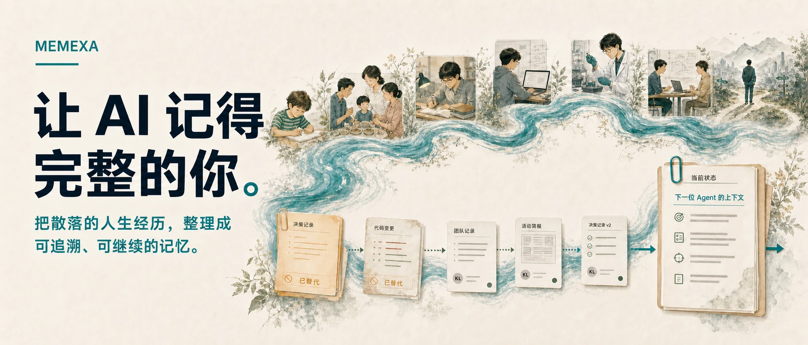
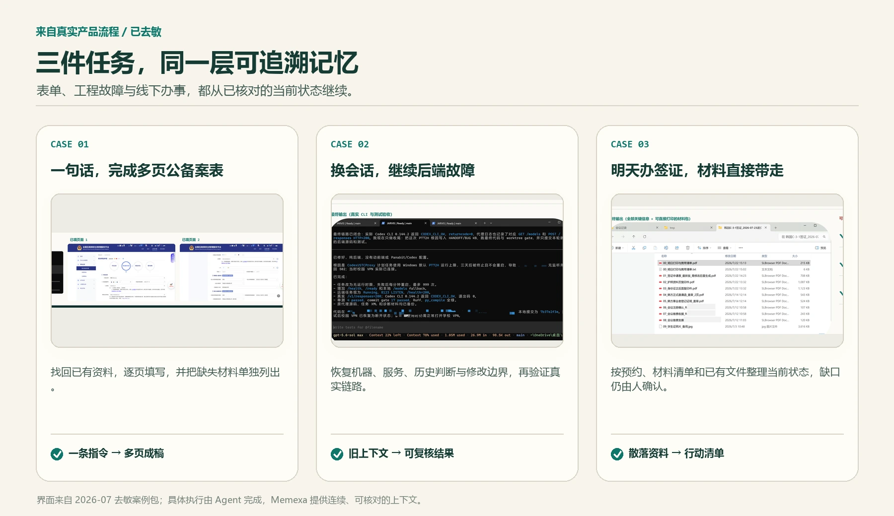

<p align="center">
  <picture>
    <source media="(max-width: 640px)" srcset="docs/assets/readme/memexa-hero-state-zh-mobile.webp">
    
  </picture>
</p>

<p align="center">
  <strong>一层可追溯的个人长期记忆，让不同应用、模型和 Agent 共享经过核对的当前状态。</strong>
</p>

<p align="center">
  <a href="https://github.com/labazhou2024/memexa/releases/download/v0.1.0/Memexa_Internal_Test_20260722_F036FCB5_R3.zip"><strong>下载 Windows 内测版</strong></a> ·
  <a href="#运行开源-demo">运行源码 demo</a> ·
  <a href="https://memexa.cn">产品介绍</a> ·
  <a href="README.md">English</a>
</p>

<p align="center">
  <a href="https://github.com/labazhou2024/memexa/actions/workflows/ci.yml"></a>
  <a href="LICENSE"></a>
  <a href="https://pypi.org/project/memexa/"></a>
  <a href="pyproject.toml"></a>
</p>

## 先从产品开始

| 我想…… | 从这里开始 |
|---|---|
| **体验桌面产品** | 下载 [Windows 10/11 x64 内测版](https://github.com/labazhou2024/memexa/releases/download/v0.1.0/Memexa_Internal_Test_20260722_F036FCB5_R3.zip)，解压后按其中的安装与隐私说明操作。 |
| **查看记忆数据契约** | 运行 `pip install memexa` 与 `memexa demo`；不需要后端、模型 API key 或额外配置。 |
| **了解完整产品** | 阅读 [memexa.cn](https://memexa.cn) 上的产品介绍。 |

Windows 内测版尚未代码签名，SmartScreen 可能显示警告。运行前请在
[Release Notes](https://github.com/labazhou2024/memexa/releases/tag/v0.1.0)
中核对文件名与 SHA-256。

## 历史与下一步之间，缺的是“当前状态”

Agent 已经会写代码、填表和整理材料。真正的断点出现在工作跨过一次会话、一个应用、
一种模型或一位协作者之后：历史还在，但它对今天意味着什么，往往丢了。

旧计划和替代它的新决定可能被同时召回；服务已经迁移，旧机器地址仍在记忆里；资料清单
找到了，却没有说明哪些仍然缺失。增加更多聊天记录不能解决这个问题，下一位 Agent
需要的是已经梳理过的当前状态。

镜我为它提供三件事：

- **什么变了**：哪些决定、版本与事实替代了旧结论。
- **什么仍然有效**：当前目标、约束、负责人和未解决缺口。
- **凭什么相信**：每个关键结论背后的消息、文档、会话或提交。

最终交付的不是一段更长的聊天记录，而是一份可以直接接手、也可以回到证据核对的
任务简报。

## 三件真实任务，同一层记忆

<p align="center">
  
</p>

这些界面来自去敏的真实产品流程，不是生成式 UI：

1. **公备案表**：一句指令形成多页草稿；已知信息被填入，缺失材料继续明确可见。
2. **后端故障**：新的 Agent 先恢复目标机器、服务状态、旧排查结论和“只改后端”的边界，
   再对真实链路完成验收。
3. **签证准备**：预约、材料清单和已有文件被整理成可执行材料包；不确定项仍交给用户确认。

具体工作由 Agent 完成；镜我提供的是一层连续、可核对的上下文，让任务从正确的位置继续。

## 镜我怎样让工作继续

1. **保留原始来源。** 导入资料时同时保留来源与时间，不把一切压成无法追溯的摘要。
2. **梳理历史。** 跨来源组织人物、事件、决定、版本和关系。
3. **维护当前状态。** 哪些已替代、已否决、已确认，哪些仍缺证据，保持明确。
4. **交付最小必要上下文。** 下一位 Agent 只收到当前任务需要的事实、约束与证据，
   而不是整份个人档案。

个人记忆默认留在用户自己的设备。导入哪些来源、向连接的 Agent 提供哪些上下文，
由用户决定。

## 运行开源 demo

```bash
python -m pip install memexa
memexa demo
```

Demo 会在内存中载入六组随包提供的合成记录，包括微信、QQ、邮件、浏览器历史、
AI 对话和录音，并生成可查询的记忆卡片。

它展示：

- 一张记忆卡怎样同时保留来源、时间、人物、叙述和证据；
- 同一组历史怎样按人物、时间线、承诺或主题查询；
- 交付给 Agent 的上下文怎样回到原始来源核对。

也可以从仓库运行：

```bash
git clone https://github.com/labazhou2024/memexa.git
cd memexa
python -m memexa.cli.main demo
python -m pytest -q
```

## 源码与安装包

> [!IMPORTANT]
> **源码和安装包不是同一个交付物。** 本仓库提供的是基于合成数据、采用
> Apache-2.0 许可的开源 demo；GitHub Release 提供的是 Windows 桌面产品内测版与
> 完整产品能力。本仓库不是该安装包的完整源码，安装包中的产品专有能力也不属于
> 本仓库的 Apache-2.0 开源许可范围。

## 公开基准

在公开的
[ATM-Bench-Hard 榜单](https://atmbench.github.io/leaderboard.html#leaderboard)
上，完整 Memexa 系统报告了 **47.85% QS** 与 **44.67% Recall@10**。
QS 衡量最终答案质量，Recall@10 衡量检索是否找到了回答所需的证据。

QS 使用榜单的 DeepSeek-V4-flash judge 评分，不应与使用 gpt-5-mini judge 的条目
直接比较；Recall@10 使用 ATM-Bench 提供的固定 Qwen3-VL-2B captions。

## 默认本地优先

- 只导入用户主动选择的来源。
- 个人记忆默认保存在用户自己的设备。
- 只向连接的 Agent 提供当前任务所需的上下文。
- 为关键事实保留可回查的来源。
- 不确定或后果重大的决定仍由人确认。

镜我基于一个简单前提：一段对话结束，不应让工作失去已经核对过的状态。
